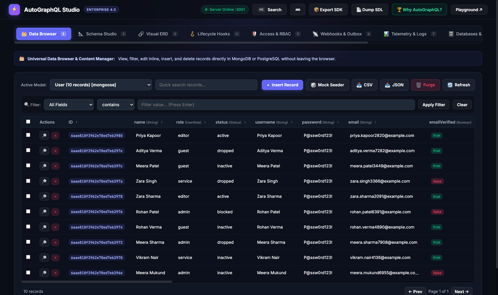
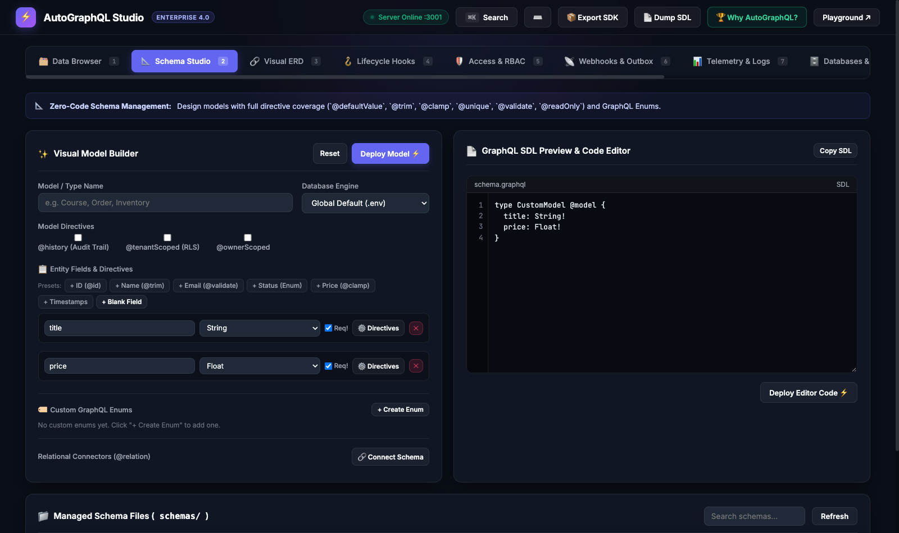
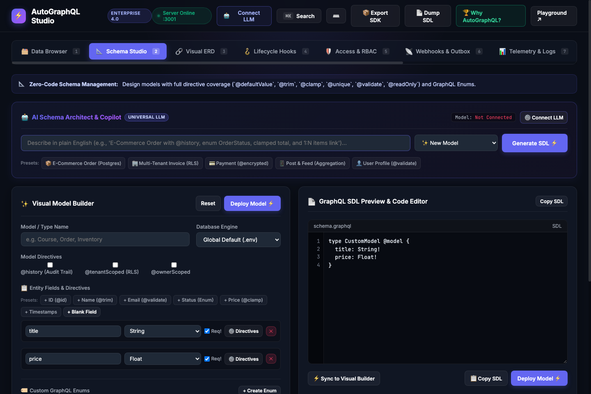
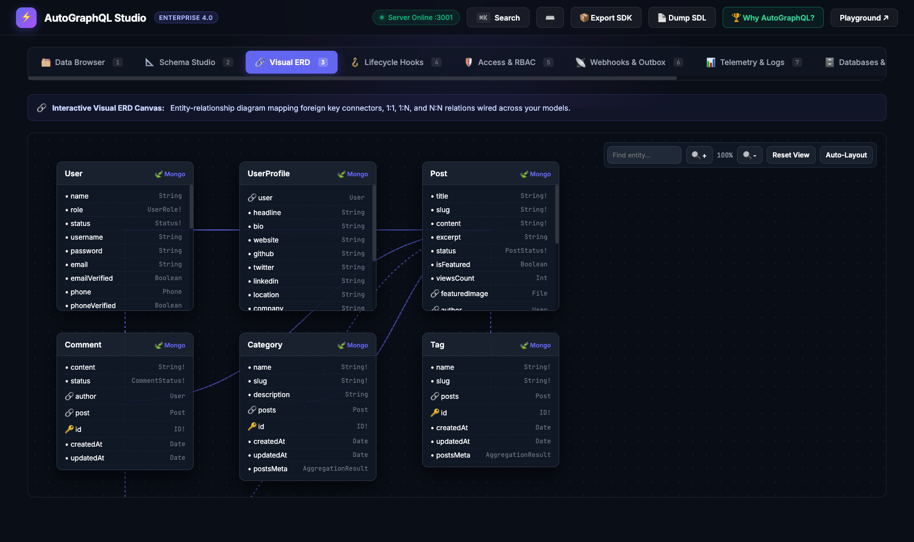
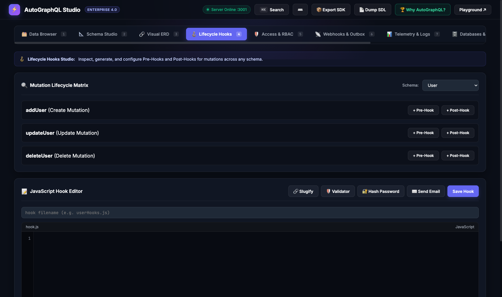
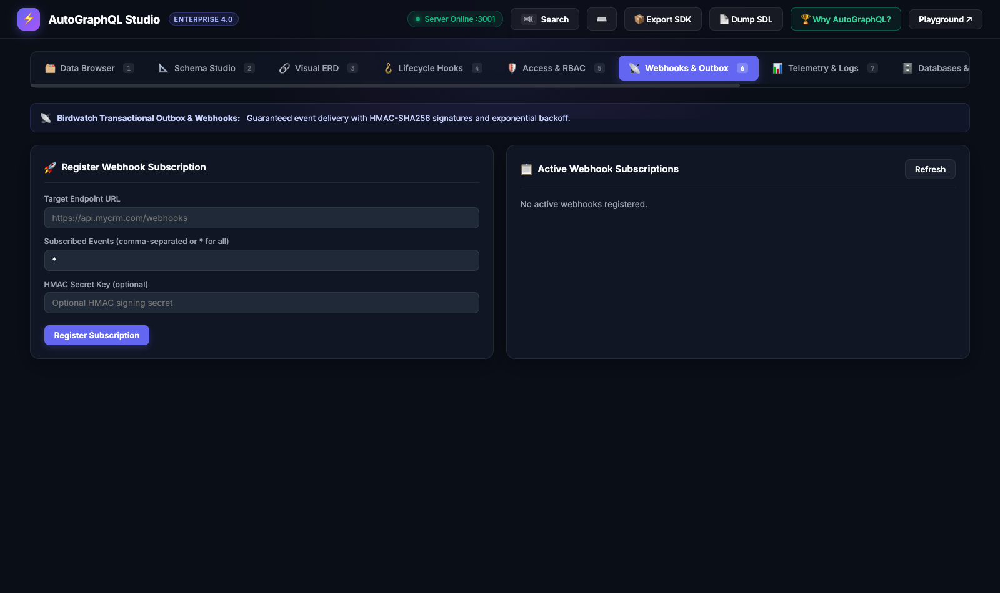
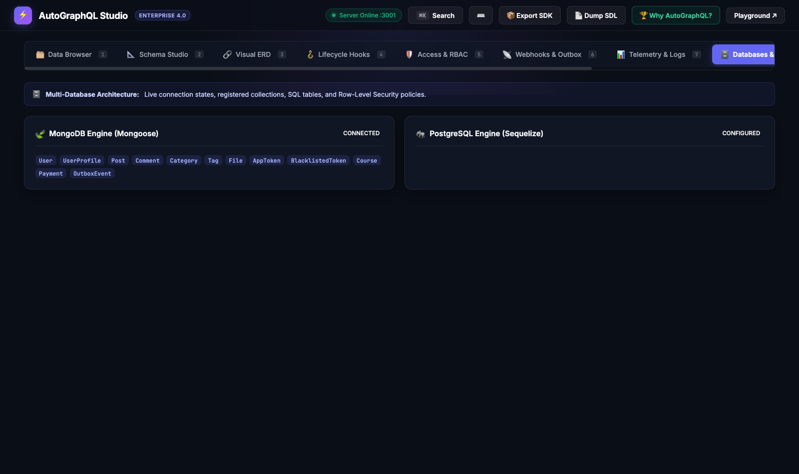

# ⚡ AutoGraphQL Studio — User & Developer Guide

> **Visual, Zero-Code Platform for Schema Design, Multi-Schema Relations, Lifecycle Hooks, Webhooks, and API Exploration.**

AutoGraphQL Studio (`/studio` or `/console`) provides an all-in-one developer console that allows developers to design data models, wire cross-schema relationships, configure Pre/Post lifecycle hooks, manage webhooks, and test GraphQL queries without writing backend boilerplate code.

---

## 📑 Table of Contents

1. [🚀 Accessing the Studio](#-accessing-the-studio)
2. [📐 Schema Studio (Visual Model Builder & Pro SDL Editor)](#-schema-studio)
   - [Visual Model Builder](#visual-model-builder)
   - [Multi-Schema Relational Connectors](#multi-schema-relational-connectors)
   - [Pro GraphQL SDL Editor](#pro-graphql-sdl-editor)
   - [Managed Schema Files & Safe Deletion](#managed-schema-files--safe-deletion)
3. [🔗 Connected Schemas Graph](#-connected-schemas-graph)
4. [🪝 Lifecycle Hooks Studio (Schema-to-Hooks Finder)](#-lifecycle-hooks-studio)
   - [Mutation Lifecycle Matrix](#mutation-lifecycle-matrix)
   - [1-Click Hook Presets](#1-click-hook-presets)
   - [Pro JavaScript Hook Editor](#pro-javascript-hook-editor)
5. [📡 Birdwatch Webhooks & Transactional Outbox](#-birdwatch-webhooks--transactional-outbox)
6. [🗄️ Databases & Multi-Tenancy (RLS)](#️-databases--multi-tenancy-rls)
7. [🚀 API Playground & Token Generator](#-api-playground--token-generator)
8. [📦 1-Click Codegen & Exports (TypeScript SDK & SDL)](#-1-click-codegen--exports)
9. [🎓 Step-by-Step Tutorial: Building a Course Platform in 2 Minutes](#-step-by-step-tutorial)

---

## 🚀 Accessing the Studio

When running the AutoGraphQL server locally:

```bash
npm run dev
```

Navigate to:
- **Studio URL:** `http://localhost:3000/studio` (or `http://localhost:3000/console`)
- **GraphQL API Endpoint:** `http://localhost:3000/graphql/core`

---

## 🗂️ Universal Data Browser & Content Manager

The **Data Browser** tab provides an interactive CRUD data grid to inspect, filter, insert, and inline-edit live database records across MongoDB and PostgreSQL.

<div align="center">
  
</div>

- **Inline Editing:** Double-click any table cell to immediately edit strings, numbers, booleans, or enums in place.
- **Search & Filter:** Apply field-specific filters with operators (`contains`, `equals`, `gt`, `lt`, `startsWith`).
- **🎲 Synthetic Mock Seeder:** Populate models with 10, 50, or 100 realistic records for development testing.
- **Batch CSV & JSON Portability:** Export collections with one click or import external datasets.

---

## 📐 Schema Studio

The **Schema Studio** tab is your central hub for designing GraphQL entities and generating dynamic database models for MongoDB or PostgreSQL.

<div align="center">
  
</div>

### 🤖 AI Schema Architect & Universal LLM Integration (BYO-LLM)

<div align="center">
  
</div>

AutoGraphQL Studio includes a built-in **Universal AI Schema Copilot** that converts natural language requirements into production-ready GraphQL SDL with complete knowledge of AutoGraphQL's custom AST directives and database architecture.

- **Bring Your Own LLM (BYO-LLM):** Connect to:
  - **Google Cloud Vertex AI (Gemini):** Native Google SDK authentication via Application Default Credentials (`gcloud auth application-default login`) — zero token pasting needed!
  - **Commercial Cloud Providers:** OpenAI (`gpt-4o`, `o3-mini`), Google Gemini (`gemini-2.0-flash`), Anthropic Claude (`claude-3-5-sonnet`), Groq (`llama-3.3-70b`), OpenRouter.
  - **Local & Offline LLMs:** Ollama (`localhost:11434`), vLLM, LocalAI, LM Studio.
  - **Custom Endpoints:** Any OpenAI-compatible gateway base URL.
- **🔒 Zero Server Storage (Privacy-First):** API keys are stored exclusively in your browser's `localStorage` and sent ephemerally over headers to the proxy route. They are never written to disk or logged.
- **Deep AutoGraphQL Directive Nomenclature Awareness:** The AI automatically applies:
  - `@model` with database selection (`database: postgres` or MongoDB default).
  - Multi-tenancy & Security: `@tenantScoped(field, claim)`, `@ownerScoped(field, claim)`.
  - Audit logs: `@history`.
  - Relations: `@relation(name, direction: "OUT" | "IN" | "BOTH")` and `@relationalMeta`.
  - Field Constraints: `@clamp(min, max)`, `@validate(regex)`, `@defaultValue(value)`, `@unique`.
  - Sanitization: `@trim`, `@nameCase`, `@upperCase`, `@lowerCase`, `@slug`.
  - Security: `@readOnly`, `@writeOnly`, `@filterOff`, `@encrypted`.
- **RAG Active Schema Awareness:** Scans existing models in `schemas/` (e.g. `User`, `Category`) so generated relational connectors wire directly to existing types.
- **AST Validation & Self-Correction:** Before rendering, generated SDL is parsed with `graphql/language`. If a syntax error occurs, the server automatically retries with AST error feedback to self-heal the output.
- **Bi-Directional Visual Builder Sync:** Click **`⚡ Sync to Visual Builder`** to parse generated or edited SDL into the Visual Model Builder cards and custom enums.

### Visual Model Builder
- **Model Name:** Enter the entity name (e.g. `Course`, `Order`, `Product`, `Invoice`).
- **Database Dialect:** Choose between:
  - `Global Default (.env)`: Follows `DEFAULT_DATABASE_DIALECT` in your `.env`.
  - `🍃 MongoDB (Mongoose)`: Generates Mongoose collections with dynamic aggregations.
  - `🐘 PostgreSQL (Sequelize)`: Generates relational SQL tables with B-Tree/GIN indexes.
- **Model Directives:**
  - `@history`: Generates audit log trail tracking every create, update, and delete mutation.
  - `@tenantScoped`: Enforces multi-tenant Row-Level Security (RLS) isolation.
  - `@ownerScoped`: Restricts record access to the creator (`userId`).

### Adding Fields & Directives
Click **`+ Add Field`** to define fields with:
- **Field Name & Data Type:** `String`, `Int`, `Float`, `Boolean`, `Date`, `JSONB`, `[String]`.
- **Constraints:** `Req` (Non-null `!`), `Uniq` (`@unique`).

### Multi-Schema Relational Connectors
Click **`🔗 Connect Schema`** to link the model to another entity:
- **Target Schema:** Select from any active model (`User`, `Category`, `Tag`, `Product`, etc.).
- **Cardinality:**
  - `1:1 (Single)`: e.g. `instructor: User @relation(name: "InstructorCourse")`
  - `1:N (Array)`: e.g. `courses: [Course] @relation(name: "UserCourses")`
  - `N:N (Many-to-Many)`: e.g. `tags: [Tag] @relation(name: "PostTags")`

### Pro GraphQL SDL Editor
- Synchronized in real time with the visual builder.
- Features line numbers, Tab key indentation (2 spaces), active status bar, and one-click copy.
- Click **`💾 Save & Deploy to schemas/`** to compile the schema directly into `schemas/<Model>.graphql`.

### Managed Schema Files & Safe Deletion
- View all schemas located in `schemas/`.
- **`✏️ Edit`**: Loads the schema into the visual form and code editor.
- **`🪝 Hooks`**: Navigates directly to the Hooks Studio with that schema pre-selected.
- **`🗑️ Delete`**: Opens the in-app confirmation modal to safely delete the schema and unload the AST model.

---

## 🔗 Connected Schemas Graph (Visual ERD)

The **Visual ERD** tab renders an interactive map of all cross-entity relationships wired across your GraphQL types:

<div align="center">
  
</div>

- **Foreign Key Connectors:** Trace relations across models with color-coded connector links.
- **Database Engine Badges:** Distinguishes MongoDB collections (`🍃 Mongo`) from PostgreSQL tables (`🐘 Postgres`).
- **Auto-Layout & Zoom:** Drag nodes to rearrange or click Auto-Layout to instantly organize complex multi-schema architectures.

---

## 🪝 Lifecycle Hooks Studio

The **Lifecycle Hooks** tab allows you to find, inspect, edit, and create Pre-Hooks and Post-Hooks for any schema.

<div align="center">
  
</div>

### Mutation Lifecycle Matrix
Select any schema from the **Active Schema** dropdown:
- **`add<Model>` (Create Mutation):**
  - `Pre-Hook`: Status badge (`Active` vs `Not set`) + `+ Create Pre-Hook` / `✏️ Inspect / Edit`.
  - `Post-Hook`: Status badge (`Active` vs `Not set`) + `+ Create Post-Hook` / `✏️ Inspect / Edit`.
- **`update<Model>` (Update Mutation):**
  - `update<Model>PreHook` & `update<Model>PostHook`.
- **`delete<Model>` (Delete Mutation):**
  - `delete<Model>PreHook` & `delete<Model>PostHook`.

### 1-Click Hook Presets
- 🔗 **Slug Generator:** Auto-generates URL slugs from titles before saving.
- 🛡️ **Value Validator:** Validates price/threshold limits and rejects invalid writes.
- 🔐 **BCrypt Password Hasher:** Hashes plaintext passwords before database storage.
- ✉️ **Welcome Email Dispatcher:** Triggers async transactional emails upon record creation.

### Pro JavaScript Hook Editor
- Edit hook code with syntax chrome, line numbers, and status indicators.
- Click **`💾 Save Hook to hooks/`** to save to `hooks/<modelName>Hooks.js`.

---

## 📡 Birdwatch Webhooks & Transactional Outbox

Manage event-driven webhooks directly from the UI:

<div align="center">
  
</div>

1. Enter the target **Endpoint URL** (e.g. `https://api.mycrm.com/webhooks`).
2. Specify **Subscribed Events** (e.g. `addOrder`, `updateUser:*`, or `*` for all).
3. Set your **HMAC Secret Key** for payload signature verification (`x-autographql-signature`).
4. Click **`🚀 Register Webhook Subscription`**.
5. Outbox events are dispatched reliably with exponential backoff retries.

---

## 🗄️ Databases & Multi-Tenancy (RLS)

<div align="center">
  
</div>

- **MongoDB Status:** Document collections, connection state, and active Mongoose models.
- **PostgreSQL Status:** Relational tables, Sequelize connection, and B-Tree/GIN index states.
- **Row-Level Security (RLS):** View active tenant isolation policies preventing cross-tenant data access.

---

## 🚀 API Playground & Token Generator

Test your generated GraphQL API directly within Studio:
- **1-Click JWT Token Generator:**
  - `🔑 Admin JWT`: Generates an `ADMIN` role JWT token with bypass capabilities.
  - `👤 User JWT`: Generates a standard `USER` role JWT with tenant scoping.
- **Interactive Query Console:** Write queries, mutations, or subscriptions with auto-completion.
- **Response Metrics:** Displays JSON output, execution status, and latency in milliseconds.

---

## 📦 1-Click Codegen & Exports

In the top header bar:
- **`📦 Export SDK`**: Automatically compiles the schema AST into a strongly-typed TypeScript Client SDK and copies it to your clipboard.
- **`📄 Dump SDL`**: Copies the entire consolidated GraphQL SDL schema for documentation, schema stitching, or Postman.

---

## 🎓 Step-by-Step Tutorial: Building a Course Platform in 2 Minutes

### Step 1: Open Schema Studio
1. Navigate to `http://localhost:3000/studio`.
2. In **Model / Type Name**, type `Course`.
3. Add fields:
   - `title`: `String`, `Req: true`
   - `slug`: `String`, `Req: true`, `Uniq: true`
   - `price`: `Float`, `Req: true`
4. Click **`🔗 Connect Schema`**:
   - Field: `instructor`, Target: `User`, Cardinality: `1:1 (Single)`
5. Click **`💾 Save & Deploy to schemas/`**.

### Step 2: Add a Slugify Pre-Hook
1. Click **`🪝 Hooks`** next to `Course` in the schema list.
2. In the **Mutation Lifecycle Matrix**, find `addCourse` and click **`+ Create Pre-Hook`**.
3. Click the **`🔗 Slug Generator`** preset.
4. Click **`💾 Save Hook to hooks/`**.

### Step 3: Run a Mutation in the API Playground
1. Switch to the **`🚀 API Playground`** tab.
2. Click **`🔑 Admin JWT`** to generate an auth token.
3. Paste the following mutation:
   ```graphql
   mutation CreateCourse {
     addCourse(input: {
       title: "Mastering AutoGraphQL 4.0"
       price: 49.99
     }) {
       id
       title
       slug
       price
       createdAt
     }
   }
   ```
4. Click **`▶ Execute Query`**.
5. Notice that the `slug` was automatically computed as `"mastering-autographql-40"` by your Pre-Hook before writing to the database!
